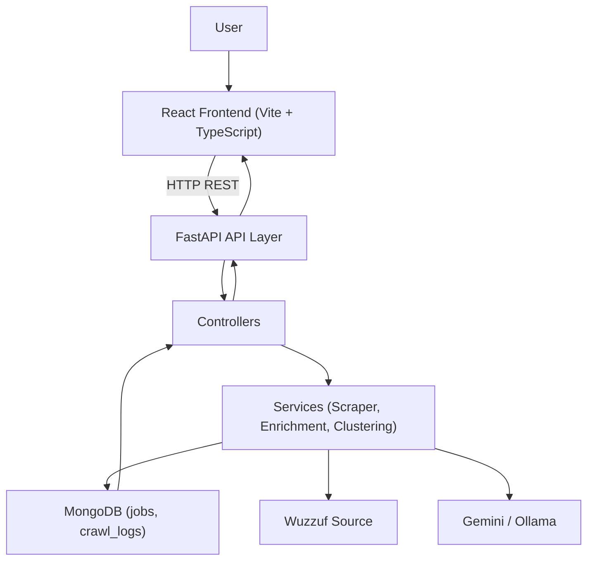
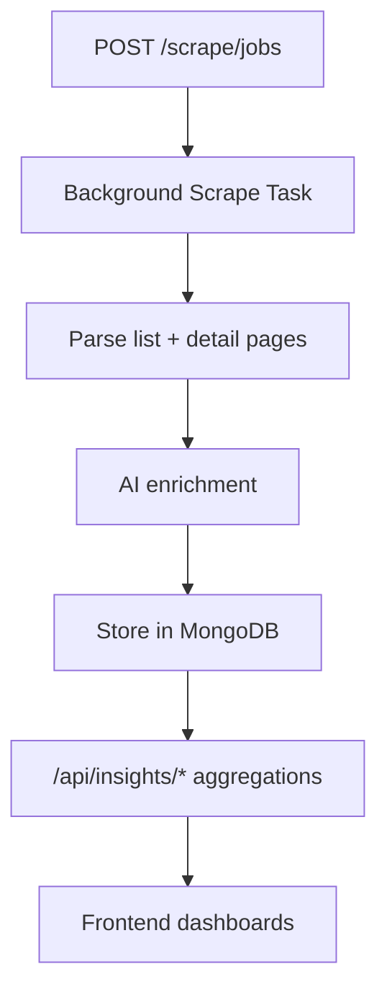

# Job Market Intelligent System

AI-powered job market intelligence platform for scraping, enriching, and analyzing technology job postings.

## Why This Project

This project turns unstructured job listings into structured market intelligence:
- what skills are most demanded,
- how salaries vary by role and level,
- which companies are hiring and for what profiles,
- how skills co-occur in real-world job requirements.

## Table of Contents

- [Highlights](#highlights)
- [Quick Start](#quick-start)
- [Architecture](#architecture)
- [Data Flow](#data-flow)
- [Tech Stack](#tech-stack)
- [Project Structure](#project-structure)
- [Environment Variables](#environment-variables)
- [API Overview](#api-overview)
- [Frontend Routes](#frontend-routes)
- [Troubleshooting](#troubleshooting)

## Highlights

- **Automated scraping** from Wuzzuf with progress tracking
- **AI enrichment** (Gemini-first, Ollama/rule fallback):
  - normalized skills
  - category/seniority inference
  - salary estimation
- **Analytics endpoints and dashboards**:
  - dashboard KPIs
  - skill graph
  - salary intelligence
  - clustering + company skill-demand analysis
- **Modern frontend** with responsive UI, charts, and heatmaps
- **Study plan assistant** endpoint for AI-guided learning support

## Quick Start

### 1) Backend

```bash
# from project root
python -m venv .venv
source .venv/bin/activate
pip install -r requirements.txt
uvicorn main:app --reload --host 0.0.0.0 --port 8000
```

Backend URLs:
- Docs: `http://localhost:8000/docs`
- Health: `http://localhost:8000/health`

### 2) Frontend

```bash
cd src/views/frontend
npm install
npm run dev
```

Frontend scripts:
- `npm run dev`
- `npm run build`
- `npm run preview`

## Architecture



## Data Flow



## Tech Stack

- **Backend**: Python, FastAPI, Uvicorn, Pydantic
- **Database**: MongoDB (Motor + PyMongo)
- **Scraping**: Scrapling, BeautifulSoup4, lxml, httpx
- **AI**: `google-genai` (Gemini), Ollama fallback
- **Analytics/ML**: scikit-learn, numpy, pandas
- **Frontend**: React 18, TypeScript, Vite, Tailwind CSS
- **State/Data**: Zustand, TanStack React Query, Axios
- **Visualization**: Recharts, D3

## Project Structure

```text
.
├── main.py
├── requirements.txt
├── data/
├── report/
├── src/
│   ├── controllers/
│   ├── models/
│   ├── services/
│   ├── utils/
│   └── views/
│       ├── api/
│       └── frontend/
│           ├── src/
│           └── package.json
```

## Environment Variables

Create `.env` in project root:

```env
MONGODB_URI=mongodb://localhost:27017
MONGODB_DB_NAME=job_board_intelligence

GOOGLE_API_KEY=your_google_api_key
OLLAMA_API_URL=http://localhost:11434/api/generate
OLLAMA_MODEL=qwen2.5

SCRAPE_MAX_PAGES=5
SCRAPE_DELAY_SECONDS=2
SCRAPE_ENRICH_CONCURRENCY=1
SCRAPE_DETAIL_DELAY_SECONDS=2.0
SCRAPE_DETAIL_WORKERS=3
SCRAPE_DETAIL_TIMEOUT_SECONDS=45.0
SCRAPE_PAGES_PER_QUERY=3
```

## API Overview

### Health
- `GET /`
- `GET /health`

### Scraper
- `POST /scrape/jobs`
- `GET /scrape/status/{task_id}`
- `POST /scrape/clear?confirm=true`

### Jobs
- `GET /api/jobs`
- `GET /api/jobs/{job_id}`

### Insights
- `GET /api/insights/dashboard`
- `GET /api/insights/skill-graph`
- `GET /api/insights/salary-intelligence`
- `GET /api/insights/skill-clustering`
- `GET /api/insights/company-hiring-patterns`
- `GET /api/insights/company-skill-matrix`
- `GET /api/insights/category-hiring-trends`

### Study Plan
- `POST /api/studyplan/chat`

## Frontend Routes

- `/` - landing page
- `/jobs` - browse/filter jobs
- `/jobs/:id` - job details
- `/dashboard` - analytics overview
- `/compare` - skill comparison
- `/salary` - salary intelligence
- `/insights/clustering` - clustering analysis

## Troubleshooting

- **`Could not import module "main"` with Uvicorn**  
  Run backend from project root (or pass correct `--app-dir`).

- **MongoDB connection failure**  
  Verify `MONGODB_URI` and Mongo service availability.

- **Gemini 429 quota exceeded**  
  The app falls back to Ollama/rule-based enrichment automatically.

- **Frontend API errors during development**  
  Ensure backend runs on `localhost:8000` (Vite proxy target).

---